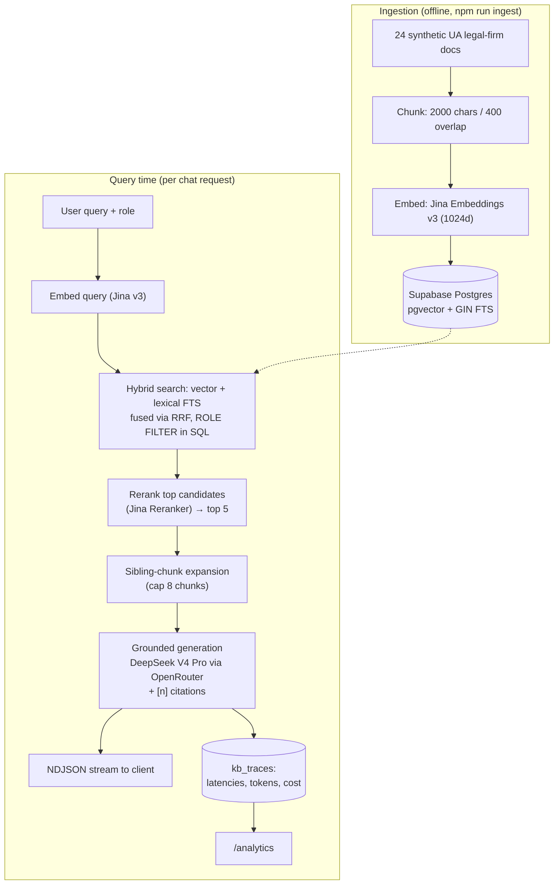
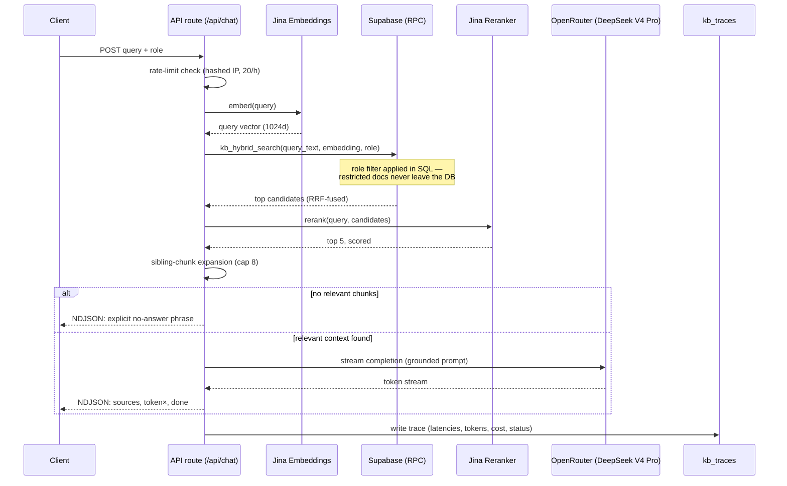

# Prasolov AI Knowledge Base

Internal AI knowledge-base assistant for a Ukrainian law firm — real hybrid RAG, role-based retrieval, and per-request observability, built over a synthetic 24-document corpus.

[](https://nextjs.org/)
[](https://www.typescriptlang.org/)
[](https://supabase.com/)
[](https://tailwindcss.com/)

**Live demo:** [prasolov-ai-kb.vercel.app](https://prasolov-ai-kb.vercel.app)

> Built as a test assignment for **Prasolov & Partners**, an Art. 130 КУпАП (driving-under-influence administrative offense) defense firm. The corpus (regulations, job descriptions, scripts, FAQs, policies) is entirely synthetic — no real firm documents were used.

## Features

- **Real hybrid search** — vector similarity (pgvector HNSW) fused with lexical full-text search (Postgres GIN, `ts_rank_cd`) via Reciprocal Rank Fusion, not vector-only.
- **Role-based retrieval** — access control enforced inside the SQL query itself, before any chunk reaches the LLM.
- **Reranking** — top candidates re-scored by a cross-encoder (Jina Reranker) before being handed to the generator.
- **Sibling-chunk expansion** — pulls in a surviving chunk's neighboring chunks from the same document so procedural detail one paragraph away isn't lost.
- **Grounded generation with citations** — every factual sentence carries a `[n]` marker traceable to a source chunk; the model must say so explicitly when the context has no answer.
- **Streaming responses** — NDJSON stream (`sources` → `token`× → `done`) with client- and server-side abort wiring.
- **Full request tracing** — every call's stage latencies, token counts, and provider-reported cost land in Postgres, visualized at `/analytics`.
- **Guardrails** — prompt-injection resistance, hourly per-IP rate limiting (hashed IPs), and an output token cap.

## Architecture



## Request flow (single chat call)



## RBAC

Access is enforced by an SQL `WHERE d.roles IS NULL OR user_role = ANY(d.roles)` filter inside `kb_hybrid_search()` — restricted documents are excluded from the candidate set at the database layer, so they never reach reranking, the prompt, or the LLM context.

| Role | Example query | Access |
|---|---|---|
| `partner` | "Who assigns the lawyer on a new case?" | Full access, including `roles: [partner]` docs (e.g. new-case assignment regulation) |
| `lawyer` | "What do I do if a state authority calls?" | Access to `[lawyer, partner]` docs (e.g. state-authority-request script, engagement regulations) plus all unrestricted docs |
| `assistant` | "Who assigns the lawyer on a new case?" | Restricted docs excluded from retrieval → explicit no-answer response |
| `hr` | "What are the per-diem rates for domestic travel?" | Full access to unrestricted HR/ops docs (FAQs, leave policy); no access to partner/lawyer-restricted docs |

## Design decisions

- **Hybrid search over pure vector** — legal queries mix exact terminology (article numbers, defined terms) with paraphrased questions; lexical FTS (`ts_rank_cd`) catches the former, embeddings the latter. RRF fuses both without needing a manually tuned weight.
- **RBAC in the SQL retrieval layer, not post-filtering** — restricted content is physically absent from what the LLM ever sees, not redacted after the fact. This removes an entire class of prompt-leakage risk.
- **Explicit no-answer, not best-effort guessing** — in a legal context, a confident wrong answer is worse than a clear refusal. The system prompt forces an exact refusal phrase when retrieval returns nothing relevant, and the API short-circuits before even calling the LLM.
- **Traces stored in Postgres, not a separate observability stack** — each request's cost/quality facts (latencies per stage, token counts, provider-reported `$` cost, relevance scores) are naturally relational and high-cardinality; querying them alongside the corpus needs no extra infrastructure for a project this size.
- **Sibling-chunk expansion** — each doc is split into a couple of chunks; a fact and its procedural conditions (deadlines, required approvals) can land in different chunks. Pulling in a surviving chunk's siblings (capped, decayed relevance) recovers procedural completeness without re-running retrieval.
- **FTS with Postgres' `'simple'` config** — stock Postgres has no Ukrainian stemming dictionary. `'simple'` (exact token matching, no stemming) is a documented, deliberate tradeoff over shipping a custom Ukrainian dictionary for a demo corpus.

## Corpus

24 synthetic Ukrainian-language documents across 6 categories — Регламенти (regulations), Посадові інструкції (job descriptions), Навчальні матеріали (training materials), Скрипти (scripts), FAQ, Внутрішні політики (internal policies) — including firm-specialization content on Art. 130 КУпАП defense work. All content was generated for this assignment; nothing is a real firm document.

## Observability

Every chat request is traced to `kb_traces`: embedding/search/rerank latencies, prompt/completion token counts, provider-reported cost, chunk counts, top/avg relevance scores, and status (`success` / `error` / `rate_limited` / `no_answer`). The `/analytics` page surfaces running totals and recent request detail directly from this table — no separate observability stack.

## Getting started

```bash
git clone <this-repo>
cd prasolov-ai-kb
npm install
cp .env.example .env.local   # fill in the 4 keys below
```

`.env.local` needs:

```
JINA_API_KEY=
OPENROUTER_API_KEY=
NEXT_PUBLIC_SUPABASE_URL=
SUPABASE_SERVICE_ROLE_KEY=
```

Works with both legacy and new-format (`sb_secret_...`) Supabase service keys.

```bash
# 1. Run supabase/migration.sql in the Supabase SQL editor
#    (creates kb_documents, kb_chunks, kb_traces, and kb_hybrid_search())

# 2. Ingest the corpus (chunk → embed → insert)
npm run ingest

# 3. Run the app
npm run dev
```

Optional: set `GENERATOR_MODEL` to swap the generation model without a code change (defaults to `deepseek/deepseek-v4-pro` via OpenRouter).

## Testing

- **Unit tests:** `npm test` — 30/30 passing (vitest) across corpus parsing, hybrid search fusion/filtering, NDJSON framing, citation extraction, rate limiting, inline rendering.
- **End-to-end protocol:** [`docs/test-run.md`](docs/test-run.md) — 9 live cases against a running dev server (RBAC enforcement both ways, no-answer phrase exactness, prompt-injection resistance, analytics updates): 8 PASS, 1 documented judgment call (a secondary procedural detail the generator sometimes omits from an otherwise-correct, correctly-cited answer — root-caused to generation style, not retrieval, and left as a known limitation).

---

Synthetic demo corpus created for this assignment; no real internal documents. Built by Volodymyr Dorosh.

Related production RAG work: [ask-about-dorosh.duckdns.org](https://ask-about-dorosh.duckdns.org) (hybrid search + LLM-as-judge evaluation + AWS CI/CD) — [source](https://github.com/volodeveth/supa-rag)
