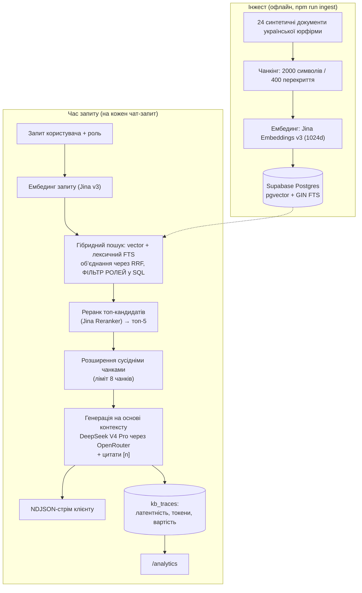
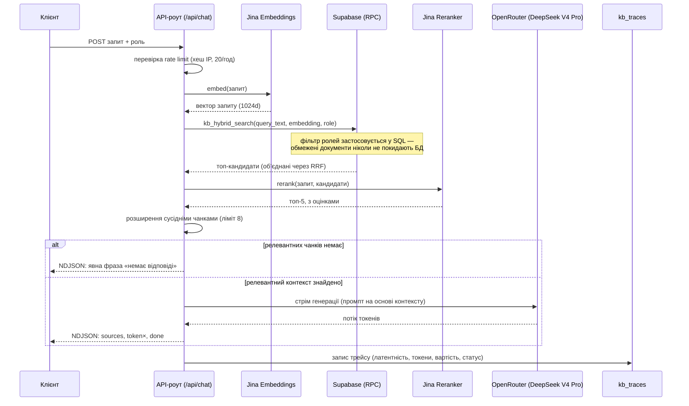

# Prasolov AI Knowledge Base

Внутрішній AI-асистент бази знань для української юридичної фірми — справжній гібридний RAG, рольовий доступ до пошуку та спостережуваність на рівні кожного запиту, побудовані на синтетичному корпусі з 24 документів.

[](https://nextjs.org/)
[](https://www.typescriptlang.org/)
[](https://supabase.com/)
[](https://tailwindcss.com/)

**Онлайн-демо:** [prasolov-ai-kb.vercel.app](https://prasolov-ai-kb.vercel.app)

> Створено як тестове завдання для **«Прасолов та Партнери»** — фірми, що спеціалізується на захисті у справах за ст. 130 КУпАП (керування транспортом у стані сп’яніння). Корпус (регламенти, посадові інструкції, скрипти, FAQ, політики) повністю синтетичний — реальні документи фірми не використовувались.

## Можливості

- **Справжній гібридний пошук** — векторна подібність (pgvector HNSW), об’єднана з лексичним повнотекстовим пошуком (Postgres GIN, `ts_rank_cd`) через Reciprocal Rank Fusion, а не лише вектори.
- **Рольовий доступ до пошуку** — контроль доступу застосовується всередині самого SQL-запиту, ще до того, як будь-який чанк потрапить до LLM.
- **Реранк** — топ-кандидати переоцінюються крос-енкодером (Jina Reranker) перед передачею генератору.
- **Розширення сусідніми чанками** — підтягує сусідні чанки того самого документа, щоб процедурна деталь за абзац від головного факту не загубилась.
- **Генерація на основі контексту з цитатами** — кожне фактичне твердження супроводжується міткою `[n]`, що веде до конкретного чанка-джерела; за відсутності відповіді в контексті модель зобов’язана сказати про це прямо.
- **Стрімінг відповідей** — NDJSON-стрім (`sources` → `token`× → `done`) з узгодженим скасуванням на клієнті та сервері.
- **Повний трейсинг запитів** — латентність по стадіях, кількість токенів і вартість від провайдера для кожного виклику потрапляють у Postgres і візуалізуються на `/analytics`.
- **Захисні механізми** — стійкість до prompt injection, погодинний rate limit на IP (хешовані IP) та обмеження на кількість токенів відповіді.

## Архітектура



## Хід одного запиту в чаті



## Контроль доступу (RBAC)

Доступ контролюється SQL-фільтром `WHERE d.roles IS NULL OR user_role = ANY(d.roles)` усередині `kb_hybrid_search()` — обмежені документи виключаються з набору кандидатів ще на рівні бази даних, тож вони ніколи не потрапляють ні до реранку, ні до промпту, ні в контекст LLM.

| Роль | Приклад запиту | Доступ |
|---|---|---|
| `partner` | «Хто призначає юриста на нову справу?» | Повний доступ, включно з документами `roles: [partner]` (наприклад, регламент призначення на нову справу) |
| `lawyer` | «Що робити, якщо телефонує представник держоргану?» | Доступ до документів `[lawyer, partner]` (наприклад, скрипт запиту від держоргану, регламент доручень) плюс усі необмежені документи |
| `assistant` | «Хто призначає юриста на нову справу?» | Обмежені документи виключено з пошуку → явна відповідь «немає відповіді» |
| `hr` | «Які добові при відрядженні по Україні?» | Повний доступ до необмежених HR/офісних документів (FAQ, регламент відпусток); без доступу до документів, обмежених для partner/lawyer |

## Дизайн-рішення

- **Гібридний пошук замість лише векторного** — юридичні запити поєднують точну термінологію (номери статей, визначені терміни) з перефразованими питаннями; лексичний FTS (`ts_rank_cd`) ловить перше, ембединги — друге. RRF об’єднує обидва підходи без потреби вручну підбирати ваги.
- **RBAC на рівні SQL-запиту, а не пост-фільтрація** — обмежений контент фізично відсутній у тому, що бачить LLM, а не просто прихований заднім числом. Це усуває цілий клас ризиків витоку через промпт.
- **Явна відмова замість здогадок «на краще»** — у юридичному контексті впевнена неправильна відповідь гірша за чітку відмову. Системний промпт змушує модель видати точну фразу-відмову, коли пошук не повертає нічого релевантного, а API в цьому випадку взагалі не викликає LLM.
- **Трейси зберігаються в Postgres, а не в окремому стеку спостережуваності** — факти про вартість і якість кожного запиту (латентність по стадіях, кількість токенів, вартість у $ від провайдера, оцінки релевантності) за природою реляційні й мають високу кардинальність; для проєкту такого масштабу запити до них поряд із корпусом не потребують додаткової інфраструктури.
- **Розширення сусідніми чанками** — кожен документ розбито на кілька чанків; факт і пов’язані з ним процедурні умови (строки, необхідні погодження) можуть опинитися в різних чанках. Підмішування сусідів чанка, що вижив (з обмеженням і зниженою релевантністю), відновлює процедурну повноту без повторного запуску пошуку.
- **FTS із конфігурацією Postgres `'simple'`** — стандартний Postgres не має словника української стемізації. `'simple'` (точний збіг токенів, без стемізації) — задокументований, свідомий компроміс замість підключення окремого українського словника для демо-корпусу.

## Корпус

24 синтетичні документи українською мовою у 6 категоріях — Регламенти, Посадові інструкції, Навчальні матеріали, Скрипти, FAQ, Внутрішні політики — включно з матеріалами спеціалізації фірми на захисті за ст. 130 КУпАП. Весь контент згенеровано спеціально для цього завдання; жоден документ не є реальним документом фірми.

## Спостережуваність

Кожен чат-запит трейситься в `kb_traces`: латентність ембедингу/пошуку/реранку, кількість токенів промпту й відповіді, вартість від провайдера, кількість чанків, максимальна та середня релевантність, а також статус (`success` / `error` / `rate_limited` / `no_answer`). Сторінка `/analytics` показує сумарні показники й деталі останніх запитів прямо з цієї таблиці — без окремого стеку спостережуваності.

## Початок роботи

```bash
git clone <this-repo>
cd prasolov-ai-kb
npm install
cp .env.example .env.local   # fill in the 4 keys below
```

`.env.local` потребує:

```
JINA_API_KEY=
OPENROUTER_API_KEY=
NEXT_PUBLIC_SUPABASE_URL=
SUPABASE_SERVICE_ROLE_KEY=
```

Працює як зі старим, так і з новим форматом (`sb_secret_...`) сервісних ключів Supabase.

```bash
# 1. Run supabase/migration.sql in the Supabase SQL editor
#    (creates kb_documents, kb_chunks, kb_traces, and kb_hybrid_search())

# 2. Ingest the corpus (chunk → embed → insert)
npm run ingest

# 3. Run the app
npm run dev
```

Опційно: встановіть `GENERATOR_MODEL`, щоб замінити модель генерації без зміни коду (за замовчуванням `deepseek/deepseek-v4-pro` через OpenRouter).

## Тестування

- **Юніт-тести:** `npm test` — 30/30 успішних (vitest): парсинг корпусу, злиття й фільтрація результатів гібридного пошуку, NDJSON-фреймінг, вилучення цитат, rate limiting, інлайн-рендеринг.
- **Наскрізний протокол:** [`docs/test-run.md`](docs/test-run.md) — 9 живих кейсів на робочому dev-сервері (RBAC в обидва боки, точність фрази «немає відповіді», стійкість до prompt injection, оновлення аналітики): 8 PASS, 1 задокументований спірний випадок (другорядну процедурну деталь генератор інколи не додає до інакше правильної й коректно процитованої відповіді — причина у стилі генерації, а не в пошуку; залишено як відому обмеженість).

---

Синтетичний демо-корпус створено спеціально для цього завдання; реальних внутрішніх документів не використано. Розробив Володимир Дорош.

Суміжний продакшн-проєкт із RAG: [ask-about-dorosh.duckdns.org](https://ask-about-dorosh.duckdns.org) (гібридний пошук + LLM-as-judge оцінювання + AWS CI/CD) — [код](https://github.com/volodeveth/supa-rag)
